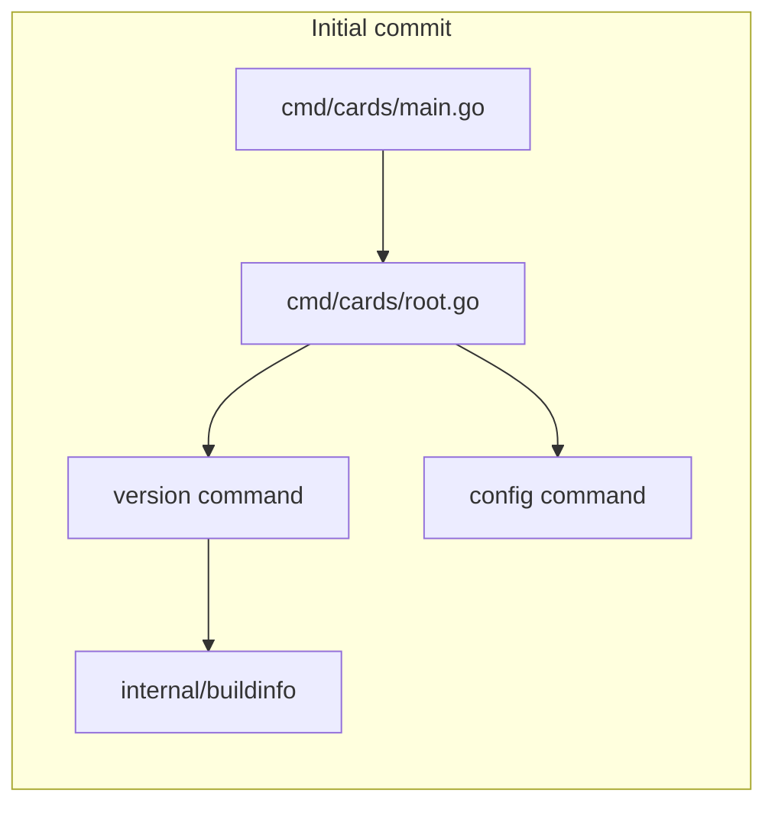
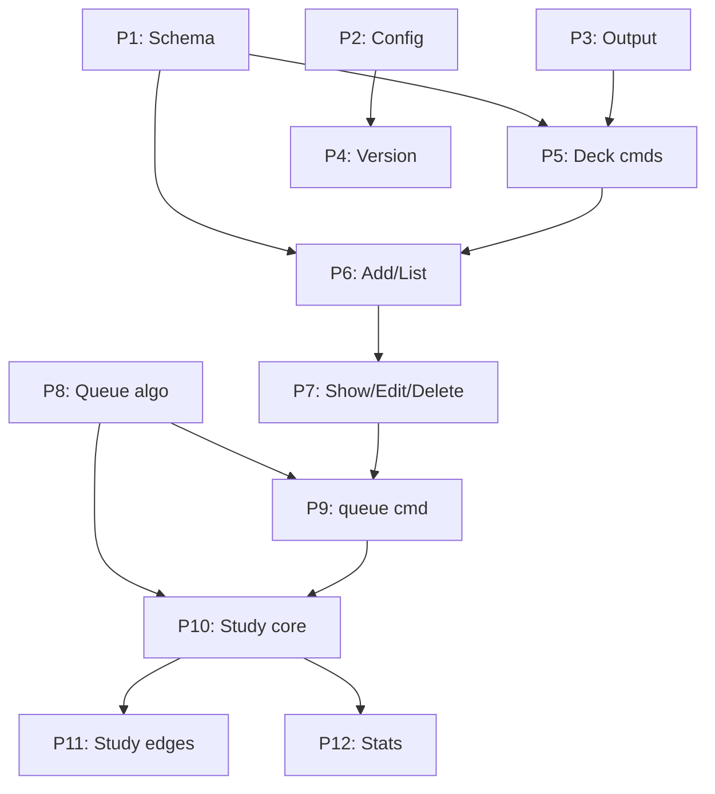

# cards-cli Initial Setup Plan

## Context

- **Source requirements:** [cards-cli-project-draft.md](cards-cli-project-draft.md) — queue-based flashcard CLI, binary `cards`, SQLite storage, AI-driven management commands, user-driven interactive `study`.
- **Template repo:** [books-cli](../books-cli) at `/home/joaovictornsv/Documents/dev/github/books-cli` — mirror its layout, CI, agent docs, and release workflow.
- **Current state:** `cards-cli/` contains only the draft doc. No git repo yet.
- **GitHub:** `gh` auth is valid; repo will be **public** at `github.com/joaovictornsv/cards-cli`.

### Note on lefthook

`books-cli` does **not** have a committed lefthook config (only default git hook samples). Per your request, we will **add** `lefthook.yml` for this project with Go-appropriate pre-commit hooks (`go test ./...`, `go vet ./...`), matching the intent of local workflow tooling even though the source repo lacks it.

---

## Phase 1 — Project scaffold (local files only)

### Directory layout (mirrors books-cli)

```
cards-cli/
├── .agents/
│   ├── git-workflow.md              # copy from books-cli (unchanged)
│   ├── github-releases/SKILL.md     # adapt module/binary names
│   └── go-code-review/SKILL.md      # adapt project name
├── .cursor/
│   ├── rules/cards.mdc              # route agent to cards-cli skill
│   └── skills/cards-cli/
│       ├── SKILL.md                 # deck/card management only (not study)
│       ├── reference.md             # flags, JSON shapes (stub/skeleton)
│       └── examples.md              # phrase → command examples (stub)
├── .github/workflows/                 # copy entire directory from books-cli (currently ci.yml)
│   └── ci.yml                       # go 1.25, test + build (adapt build path to ./cmd/cards)
├── cmd/cards/
│   ├── main.go
│   └── root.go                      # cobra root + --json flag
├── internal/
│   └── buildinfo/
│       ├── buildinfo.go             # Version = "0.0.0-dev"
│       └── buildinfo_test.go
├── docs/
│   └── COMMANDS.md                  # full command reference skeleton from draft §3
├── migrations/
│   └── fs.go                        # embed FS (no SQL yet — added in V1 issues)
├── CHANGELOG.md                     # [Unreleased] + empty v1 placeholder
├── NEXT_STEPS.md                    # post-v1 features (see below)
├── LICENSE                          # MIT, same as books-cli
├── README.md                        # project overview, setup, dev commands
├── go.mod                           # module github.com/joaovictornsv/cards-cli, go 1.25
├── go.sum
├── .gitignore                       # /cards, *.db, tmp/
├── lefthook.yml                     # pre-commit: go test + go vet
└── docs/PROJECT_DRAFT.md            # move draft here (keep requirements in repo)
```

### Dummy Go code (initial commit scope)

Minimal working CLI — enough to `go build` and `go test`:

- **cobra root** (`cards`) with persistent `--json` flag, `SilenceUsage`/`SilenceErrors` like [books-cli/cmd/books/root.go](../books-cli/cmd/books/root.go)
- **`cards version`** — prints buildinfo via a tiny formatter (can inline JSON in cmd for now; full `internal/output` comes in a V1 issue)
- **`cards config`** — stub returning resolved paths (can implement minimal `internal/config` now since it's small and mirrors books-cli pattern with `CARDS_DB` → `~/.config/cards/config.toml` → `~/.local/share/cards/cards.db`)
- **No DB commands yet** — other subcommands registered as stubs or omitted until issues are implemented



### Files copied/adapted from books-cli

| Source | Target | Adaptation |
|--------|--------|------------|
| `.agents/git-workflow.md` | same | verbatim |
| `.agents/github-releases/SKILL.md` | same | `books` → `cards`, module path, asset name `cards-linux-amd64` |
| `.agents/go-code-review/SKILL.md` | same | `books-cli` → `cards-cli` |
| `.cursor/skills/books-cli/*` | `.cursor/skills/cards-cli/*` | management commands only; **study is user-run, not in skill** |
| `.cursor/rules/books.mdc` | `.cursor/rules/cards.mdc` | flashcard/deck triggers |
| `.github/workflows/` (entire dir) | same | copy `ci.yml` verbatim, adapt `go build` to `./cmd/cards` |
| `LICENSE`, `.gitignore` | same | minor path tweaks |
| `CHANGELOG.md` | same | reset to Unreleased only |
| `docs/COMMANDS.md` | skeleton | all v1 commands documented as spec (from draft §3), marked "not yet implemented" where applicable |

### Agent skill design (key difference from books-cli)

Per draft §1.1:

| Who | Commands |
|-----|----------|
| **AI agents** | `deck *`, `add`, `list`, `show`, `edit`, `delete`, `queue`, `stats`, `config` — always `--json` |
| **Human (terminal)** | `cards study <deck>` — interactive, no agent skill coverage |

Skill will state: **do not** explore `cmd/`, `internal/`, or `docs/COMMANDS.md` for usage; use skill files instead (same pattern as books-cli).

### NEXT_STEPS.md content (post-v1, not issues)

Features planned for releases after v1 (not GitHub issues at scaffold time):

- **Search command** — like books-cli: `cards search` with repeatable `--term` flags; OR-match across card front/back and deck names; `--json` for agents
- CSV / JSON import and export
- **Shuffle deck** — reshuffle the entire deck queue order (not just the current study batch); useful for breaking fixed patterns; still queue-position based, no date scheduling

**Explicitly excluded** from future scope (removed per review): tags, stale bump, books-cli integration, markdown rendering, Anki import/export, media, date-based scheduling, sync, cloze deletions, web UI, archive.

---

## Phase 2 — Git init and initial commit

1. `git init` in `/home/joaovictornsv/Documents/dev/github/cards-cli`
2. `go mod tidy` to populate `go.sum`
3. Verify: `go test ./...` and `go build -o cards ./cmd/cards`
4. Optional: `lefthook install` (document in README if lefthook not installed globally)
5. Initial commit message (following books-cli style):

```
Initial project scaffold for cards-cli.

Cobra skeleton with version/config commands, agent skills, CI, and docs mirroring books-cli conventions.
```

---

## Phase 3 — GitHub repository and push

1. Create remote repo: `gh repo create joaovictornsv/cards-cli --public --source=. --remote=origin --description "CLI flashcard app for terminal study sessions"`
2. Push: `git push -u origin main`
3. Confirm repo URL: `https://github.com/joaovictornsv/cards-cli`

---

## Phase 4 — V1 GitHub issues (small, testable scope)

Each issue = one PR-sized unit with clear acceptance criteria and tests. Labels: `v1` (and optionally `enhancement`).

**Issue title format:** `[P<n>] <short title>` — e.g. `[P1] SQLite schema and migration runner`. Priority `P1` is implemented first; saying *"implement the next priority issue"* means pick the lowest `P<n>` that is still open. Issue body repeats the priority and lists dependencies.

### [P1] SQLite schema and migration runner
- Tables: `decks`, `cards`, `queue` (ordered `card_id` per deck via `position` column), `schema_migrations`
- Card fields: `front`, `back`, `created_at`, `updated_at`, optional stats columns
- Reuse books-cli embed + migrate pattern ([migrations/fs.go](../books-cli/migrations/fs.go), [internal/db/migrate.go](../books-cli/internal/db/migrate.go))
- Tests: in-memory DB opens, migrations apply idempotently

### [P2] Config resolution and `cards config`
- `CARDS_DB` env → `database` in `~/.config/cards/config.toml` → default `~/.local/share/cards/cards.db`
- Global config keys: `batch_size` (default 4), `again_offset` (2), `hard_offset` (5)
- `--json` output on `config`
- Tests: path resolution precedence

### [P3] Output layer (`internal/output`) and CLI root wiring
- `Formatter` interface: table + JSON modes
- Shared `--json` persistent flag on root
- `runWithRepo` helper pattern (stub repo OK until Issue 1 merges)
- Tests: JSON envelope shapes

### [P4] `version` command and buildinfo
- `cards version` / `cards --version` with `--json` metadata (`version`, `commit`, `go_version`)
- LDFLAGS documented in release skill
- Tests: version output structure

### [P5] Deck commands (`deck create`, `deck list`, `deck delete`)
- Create by name, list with card counts, delete deck + all cards + queue entries
- Friendly errors for duplicate name / not found
- Tests per command

### [P6] Card add and list
- `cards add <deck> --front --back` inserts card at **front** of queue
- `cards list <deck>` returns metadata (id, front preview, timestamps) — not full queue walk
- `--json` on both
- Tests: add inserts at position 0, list returns expected shape

### [P7] Card show, edit, delete
- `cards show <deck> <id>`, `cards edit <deck> <id> --front/--back`, `cards delete <deck> <id>`
- Delete removes card from deck **and** queue (no archive)
- Duplicate front text allowed
- Tests per operation

### [P8] Queue re-insert algorithm (pure logic)
- Implement grading rules from draft §2.3: `again` → front+2, `hard` → front+5, `easy` → end
- Position measured from front **at re-insert time** (after card removed)
- Unit tests using draft §9 walkthrough (`[A,B,C,D,E,F,G,H]`, batch 4) as golden case
- No CLI yet — `internal/queue` or `internal/models` package

### [P9] `cards queue` command
- Show current queue order (card IDs + front preview)
- `--json` output
- Tests: order matches DB state after adds/deletes

### [P10] Interactive study session (core)
- `cards study <deck>` — one card at a time: show front → reveal (space/enter) → grade (arrows 1/2/3)
- Pull batch from front (`min(limit, deck_size)`), immediate re-insert after each grade
- Persist queue after each graded card
- Progress indicator `[i/N]`
- Tests: session logic with mocked input where possible; integration test for queue mutations

### [P11] Study session flags and edge cases
- `--limit` override (default from config)
- `--json` session log (secondary to interactive UX)
- Empty deck → friendly error + hint
- Mid-session quit (`q`) — graded cards saved, unreviewed batch cards stay at front
- Same-session repeats allowed
- Tests for each edge case

### [P12] Stats and session nudge
- Track sessions run, per-card `times_reviewed`, `last_grade`, `last_reviewed_at`
- `cards stats <deck>` with nudge (e.g. "last session: 3 days ago")
- `--json` output
- Tests: stats update after study session



**Implementation order:** P1 → P2 → P3 → P4 → P8 (can start after P1, parallel with P2–P4) → P5 → P6 → P7 → P9 → P10 → P11 → P12

Issues will **not** cover NEXT_STEPS.md items (search, import/export, deck shuffle, etc.).

---

## Phase 5 — Verification checklist

After all phases:

- [ ] `go test ./...` passes locally and in CI
- [ ] `go build -o cards ./cmd/cards` produces binary
- [ ] `cards version` and `cards config` work
- [ ] Agent skill, rules, COMMANDS.md, and README are consistent with draft
- [ ] GitHub repo live with initial commit on `main`
- [ ] 12 V1 issues created with `[P1]`–`[P12]` titles, `v1` label, and acceptance criteria
- [ ] `.github/workflows/` copied from books-cli (CI runs on push/PR)

---

## Risks / prerequisites

- **Sandbox vs network:** `gh` commands need network access (confirmed working outside sandbox).
- **lefthook:** optional locally; CI is the authoritative gate. README will note `lefthook install` for contributors.
- **Study TUI library:** v1 uses plain terminal control (draft §5); if raw mode is painful, a minimal dependency (e.g. `golang.org/x/term` + `bufio`) is acceptable — decide during P10, not in scaffold.
